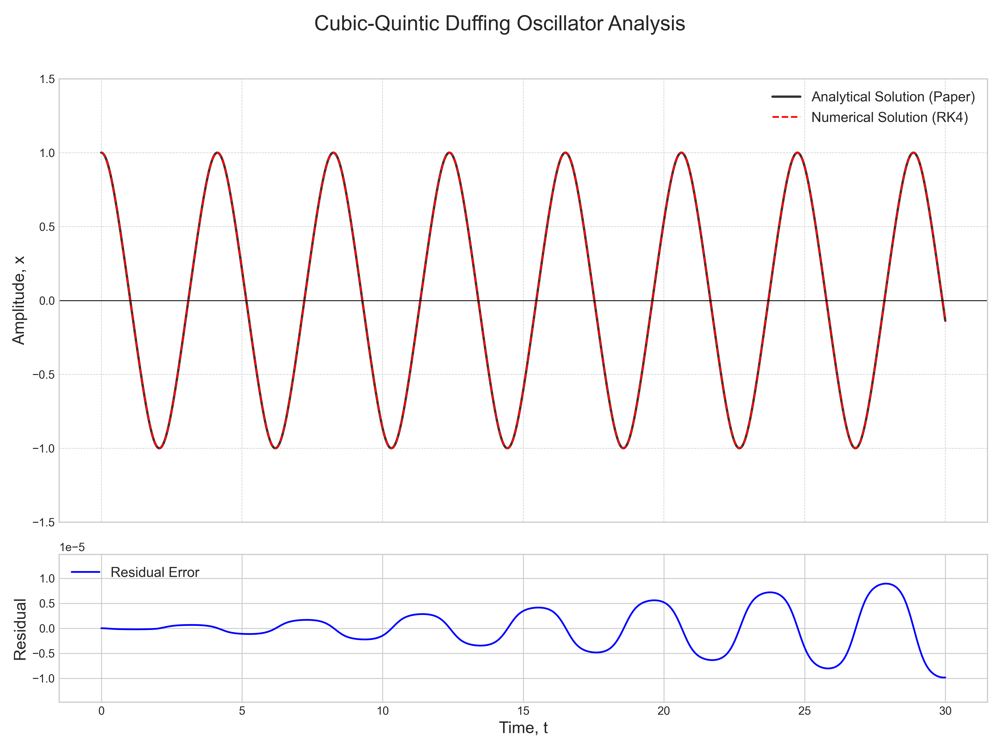

# Numerical Solution of the Cubic-Quintic Duffing Equation
The following report contains code and documentation for a mini project in Numerical Analysis II. The project includes implementations of numerical methods to solve the Cubic-Quintic Duffing equation and visualizations of the results.

## Results
The results of the numerical solutions are visualized in the following graphs:

## Animations
Animations of the system's behavior over time can be found in the accompanying files:

